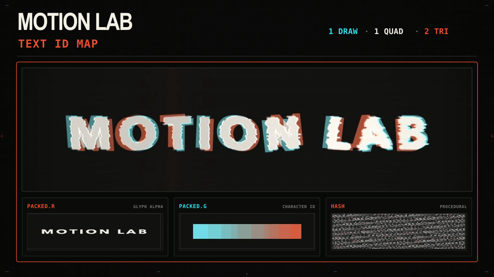
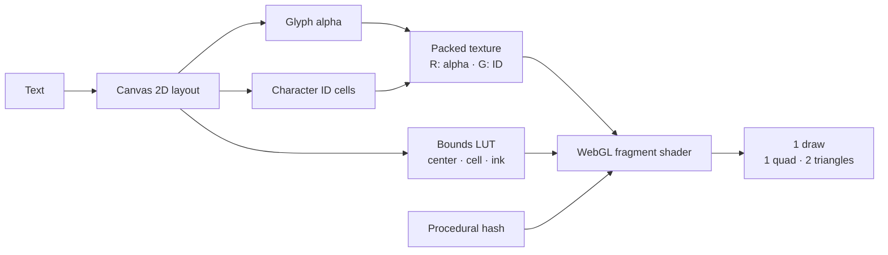

# Text ID Map Motion Lab

**English** · [简体中文](./README.zh-CN.md)


A character ID map drives per-character motion on a single quad. Canvas 2D
builds a packed text texture and a bounds lookup texture; the fragment shader
uses each pixel's character ID to control timing, transforms, slicing,
fragments, and color echoes.



## Motion sequence

The shader runs a 5.6-second loop. With the default character phase, the main
events are:

| Time | Event |
| --- | --- |
| `0.00–1.78 s` | Characters enter in sequence, appear through horizontal slices, and settle with a damped wobble |
| `1.67–2.57 s` | Orange and cyan phase echoes, channel offsets, and signal tears cross the text |
| `2.49–3.61 s` | Glyphs break into small procedural fragments and disperse |
| `3.54–4.70 s` | The fragments reverse direction and assemble back into the original glyphs |
| `4.70–5.60 s` | The text holds while the background sweep completes, then the loop restarts |

The ranges overlap by design. **Character phase** changes both the entry spread
and the per-character delay.

## Controls

| Control | Range or action |
| --- | --- |
| Text | Rebuild the packed text and bounds textures; up to 28 characters |
| Intensity | `0–100%`; scale movement, tearing, fragments, and color separation |
| Speed | `0.15–2.50×`; change timeline playback speed |
| Character phase | `0.00–1.50`; change the stagger between characters |
| Timeline | Scrub any point in the `0–5.6 s` loop |
| Play / Pause | Start or stop timeline playback |
| Show debug info | Display the quad geometry, character-ID colors, packed channels, and hash noise |
| Reset | Restore the default text and motion settings and return the timeline to zero |

When the browser requests reduced motion, the timeline starts paused.

## Rendering pipeline



### Packed text data

Canvas 2D lays out the text in a `1600 × 900` buffer. The renderer uploads two
nearest-filtered textures:

| Texture | Contents |
| --- | --- |
| Packed text | `R` stores glyph alpha; `G` stores the character ID for each layout cell |
| Bounds LUT | A `256 × 2` lookup texture stores each character's center, cell size, and ink size |

The fragment shader reads the ID first, then looks up the owning character's
bounds. This reconstructs character-local coordinates without separate geometry
or draw calls for each glyph.

### ID-safe filtering

Glyph alpha still needs smooth filtering while it moves. The shader reads four
neighboring texels manually and accepts a tap only when its character ID matches
the current glyph. This keeps adjacent characters from bleeding into each other
during rotation, shear, slicing, and fragment motion.

Procedural hashes derive repeatable slice offsets, fragment positions,
directions, and survival values from the character ID and local fragment cell.
No noise texture is required.

## Debug view

Enabling **Show debug info** adds:

- The complete quad boundary and its two-triangle diagonal
- A character-ID color overlay on the animated text
- Live `PACKED.R` glyph alpha and `PACKED.G` character ID views
- The procedural hash-noise field
- The `1 DRAW · 1 QUAD · 2 TRI` render status

The panels below the renderer show the full character ID map and the ID assigned
to each text unit.

## Run locally

From the repository root, start a static file server:

```bash
python3 -m http.server 4174
```

Open [http://127.0.0.1:4174/](http://127.0.0.1:4174/) in a browser with WebGL
enabled. The renderer uses WebGL 2 when available and falls back to WebGL 1.
The lab uses static HTML, CSS, and JavaScript, so it needs no package installation
or build step.

## Project layout

```text
index.html                  page structure and controls
app.js                      Canvas 2D texture build, GLSL, timeline, and rendering
styles.css                  responsive interface styles
cover.png                   project cover
assets/readme/hero.gif      animated README hero
README.zh-CN.md             Simplified Chinese documentation
```
