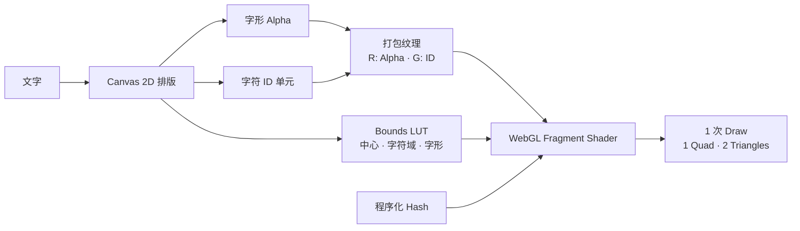

# Text ID Map Motion Lab

[English](./README.md) · **简体中文**


字符 ID Map 在单个 Quad 上驱动逐字动效。Canvas 2D 生成打包文字纹理与 Bounds
查找纹理；Fragment Shader 根据像素中的字符 ID，分别控制每个字的时序、变形、
切片、碎片和颜色重影。


## 动效阶段

Shader 运行一段 5.6 秒的循环。使用默认字符相位时，主要事件如下：

| 时间 | 事件 |
| --- | --- |
| `0.00–1.78 s` | 字符依次飞入，通过横向切片显现，再以阻尼回摆落定 |
| `1.67–2.57 s` | 橙青错相、通道偏移与信号撕裂穿过文字 |
| `2.49–3.61 s` | 字形分解为程序化小碎片并向外消散 |
| `3.54–4.70 s` | 碎片反向汇聚，重新组成原始字形 |
| `4.70–5.60 s` | 文字保持稳定，背景扫描完成后重新循环 |

各阶段有意重叠。**字符相位**会同时改变入场跨度和逐字延迟。

## 控制项

| 控件 | 范围或作用 |
| --- | --- |
| 文字 | 重建打包文字纹理与 Bounds 纹理；最多 28 个字符 |
| 强度 | `0–100%`；控制位移、撕裂、碎片和色差幅度 |
| 速度 | `0.15–2.50×`；控制时间轴播放速度 |
| 字符相位 | `0.00–1.50`；控制字符之间的错峰间隔 |
| 时间轴 | 拖动查看 `0–5.6 s` 循环中的任意时刻 |
| 播放 / 暂停 | 开始或停止时间轴 |
| 显示调试信息 | 显示 Quad 几何、字符 ID 着色、打包通道和 Hash Noise |
| 恢复默认 | 恢复默认文字与动画参数，并把时间轴归零 |

浏览器启用“减少动态效果”时，时间轴会默认暂停。

## 渲染管线



### 打包文字数据

Canvas 2D 在 `1600 × 900` 缓冲区里完成文字排版。渲染器上传两张使用最近邻
采样的纹理：

| 纹理 | 内容 |
| --- | --- |
| 打包文字纹理 | `R` 保存字形 Alpha；`G` 保存每个排版单元的字符 ID |
| Bounds LUT | 一张 `256 × 2` 查找纹理，保存每个字符的中心、字符域尺寸和字形尺寸 |

Fragment Shader 先读取字符 ID，再查询这个字符的 Bounds，由此还原字符局部
坐标。所有字符共用一个 Quad，不需要为每个字创建独立几何或 Draw Call。

### 避免字符间串色

字形运动时仍需要平滑的 Alpha 采样。Shader 手动读取周围四个 Texel，并只接受
字符 ID 与当前字一致的采样点。这样可以在旋转、斜切、切片和碎片运动时避免
相邻字符互相污染。

程序化 Hash 根据字符 ID 和局部碎片单元生成稳定的切片偏移、碎片位置、运动
方向和存活值，不需要额外的 Noise 纹理。

## 调试视图

打开 **显示调试信息** 后，画面会增加：

- 完整 Quad 边框，以及表示两个三角形的对角线
- 动态文字上的字符 ID 着色
- 实时 `PACKED.R` 字形 Alpha 与 `PACKED.G` 字符 ID
- 程序化 Hash Noise
- `1 DRAW · 1 QUAD · 2 TRI` 渲染状态

渲染器下方还会持续显示完整字符 ID Map，以及每个文字单元对应的 ID。

## 本地运行

在仓库根目录启动静态文件服务器：

```bash
python3 -m http.server 4174
```

在已启用 WebGL 的浏览器里打开
[http://127.0.0.1:4174/](http://127.0.0.1:4174/)。渲染器优先使用 WebGL 2，
不可用时回退到 WebGL 1。页面只使用静态 HTML、CSS 和 JavaScript，不需要安装
依赖，也不用先构建应用。

## 项目结构

```text
index.html                  页面结构与控制面板
app.js                      Canvas 2D 贴图生成、GLSL、时间轴与渲染
styles.css                  响应式界面样式
cover.png                   项目封面
assets/readme/hero.gif      README 动态 Hero
README.md                   英文文档
```
